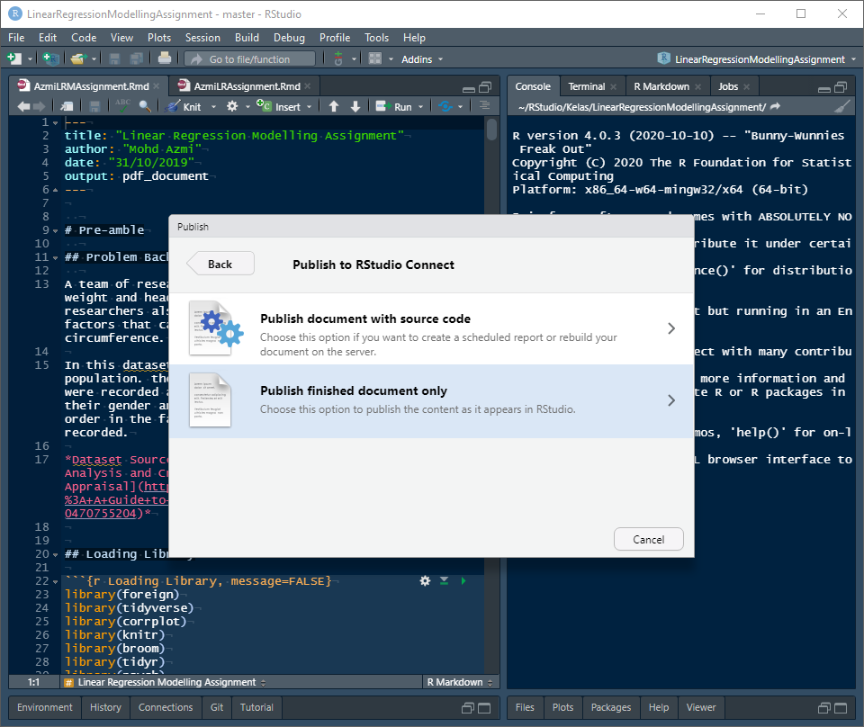

```{r setup, include=FALSE}
knitr::opts_chunk$set(echo = FALSE)
library(pacman)
p_load(tidyverse, Gmisc, grid)
```

## Target Audience

Aim: Introductory

- Teaching Staff
- Student

Disclaimer

- Very simple slide
  - short learning curve
- Be creative!
- Try, try, try


## Motivation

- Statistic and Public Health
- Multiple output file for same purpose

## Teaching Statistic

- fast, reproducible


x <- runif(100, 5, 10)

y <- sample(5:10, 100, replace = T)

y2 <- (x+y/2) 

fake <- data.frame(x,y,y2) 

with(fake, plot(x,y2))


## 

```{r}
x <- runif(100, 5, 10)
y <- sample(5:10, 100, replace = T)
y2 <- (x+y/2)
fake <- data.frame(x,y,y2)
with(fake, plot(x,y2))
```

## Tidyverse

- example using tidyverse

tibble(x=runif(100, 5, 10), y2=(x+sample(5:10, 100, replace = T))/2)


%>% ggplot(aes(x,y2)) + geom_point()


##

```{r}
tibble(x=runif(100, 5, 10), y=sample(5:10, 100, replace = T), y2 = (x+y/2)) %>% 
  ggplot(aes(x,y2)) + geom_point()
```


## One file, various output


## One file, various output


## One file, various output


## Generate simple chart directly

- Gmisc and grid package 
- ggplot (https://rpubs.com/phiggins/461686)


```{r}
library(Gmisc)
library(grid)
grid.newpage()
exposure <-
  "Exposure
  (e.g. Coffee)"
expbox <- boxGrob(exposure, x=.2, y=.8)
outcome <-
  "Outcome
  (e.g. Lung Ca)"
outbox <- boxGrob(outcome, x=.8, y=.8)
confounder <-
  "Confounder
  (e.g. Smoking)"
confbox <- boxGrob(confounder, x=.5, y=.2)
connectGrob(expbox, outbox, "horizontal")
connectGrob(expbox, confbox, "vertical")
connectGrob(confbox, expbox, "vertical")
connectGrob(confbox, outbox, "vertical")

expbox
outbox
confbox
```


## Student

Of course!

- Main reason: reproducible


## Student Assigment

- pdf
- html

## Student Assigment


## Student Assigment


## Assignment Submission

- manual
- publish
  - RPubs
  - RStudio Connect

## Assignment Submission


## Assignment Submission



## Assignment Submission


## Assignment Submission


## Closing

Various Source

- R Markdown: The Definitive Guide https://bookdown.org/yihui/rmarkdown/
- bookdown: Authoring Books and Technical Documents with R Markdown https://bookdown.org/yihui/bookdown/
- pdf theme
  - rmdformat
  - prettydoc
- presentation
  - beamer
  - ioslide
  - slidy
  - rmdshower